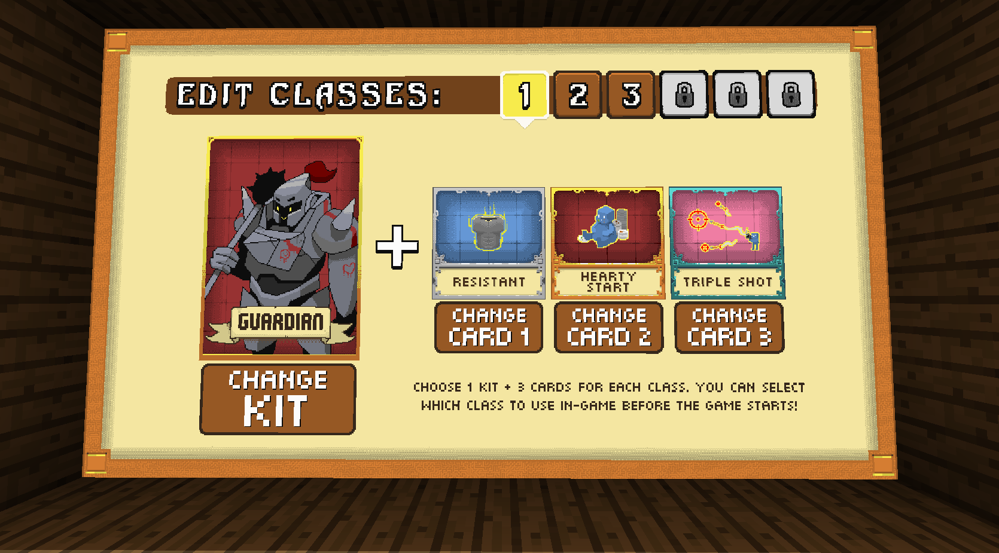

#  Diorite Project [](https://travis-ci.org/Diorite/Diorite)

# Modules
- [ ] **org.diorite:diorite-parent**
- [ ] **org.diorite.utils:diorite-utils** (*Diorite Utils*)
    - [ ] [**org.diorite.utils:commons** (*Diorite Utils - Commons*)](#diorite-utils---commons)
        - set of basic libraries.
    - [ ] [**org.diorite.utils:config** (*Diorite Utils - Config*)](#diorite-utils---config)
        - config serialization/deserialization framework.
        - depends on: 
            - *org.diorite.utils:commons*
    - [ ] [**org.diorite.utils:injection** (*Diorite Utils - Injections*)](#diorite-utils---injections)
        - object injection framework. (This isn't normal dependency injection)
        - depends on: 
            - *org.diorite.utils:unsafe*
            - *org.diorite.utils:commons*
    - [ ] [**org.diorite.utils:unsafe** (*Diorite Utils - Unsafe*)](#diorite-utils---unsafe)
        - utils related to bytecode manipulation and sun.misc.Unsafe
        - depends on: 
            - *org.diorite.utils:commons*
- [ ] [**ord.diorite:gameprofile** (*GameProfile API*)](#gameprofile-api)
    Standalone API for Mojang auth services. 
- [ ] [**ord.diorite.shared:diorite-shared** (*Diorite Shared*)](#diorite-shared)  
    Shared API used by diorite server, client and proxy projects.  
    Divided to api and core modules:
    - **ord.diorite.shared:shared-api** 
    - **ord.diorite.shared:shared-core** 
    - depends on: 
        - *org.diorite.utils:commons*
        - *org.diorite.utils:config*
        - *org.diorite.utils:injection*
        
    Main features of shared module:
    - [ ] [**Chat system**](#chat-system)
    - [ ] [**Permissions system**](#permissions-system)
    - [ ] [**Commands system**](#commands-system)
    - [ ] [**Plugins system**](#plugins-system)
    - [ ] [**Messages system**](#messages-system)
    - [ ] [**Scheduler system**](#scheduler-system)
    - [ ] [**Groovy scripting system**](#groovy-scripting-system)
    - [ ] [**Scoreboard system**](#scoreboard-system)
    - [ ] [**Effects system**](#effects-system)
    - [ ] [**Abstract NBT API - SSF (*Simple Storage System*)**](#simple-storage-system)
    
- [ ] [**ord.diorite:diorite** (*Diorite*)](#diorie)
    Main module, server and client of game.  
    Divided to few modules:
    - **ord.diorite:diorite-api** - only api of diorite.
    - **ord.diorite:diorite-core** - core code, additional methods, abstracts classes that might change so they can't be in the API.
    - **ord.diorite:diorite-impl** - diorite implementation of the diorite api.
    - depends on: 
        - *org.diorite.utils:commons*
        - *org.diorite.utils:config*
        - *org.diorite.utils:injection*
        - *ord.diorite.shared:shared-api*
        - *ord.diorite.shared:shared-core*
        - *ord.diorite.extra:gui* 
        
- [ ] [**ord.diorite.stonegate:stonegate** (*Stonegate*)](#stonegate)
    Proxy for diorite servers, allows connecting multiple servers to one network.  
    Contains diorite-shared api allowing to easily port server-independent code between server and proxy.

    Divided to few modules:
    - **ord.diorite.stonegate:stonegate-api** - only api of Stonegate.
    - **ord.diorite.stonegate:stonegate-core** - core code, additional methods, abstracts classes that might change so they can't be in the API.
    - **ord.diorite.stonegate:stonegate-impl** - diorite implementation of the stonegate api.
    - depends on: 
        - *org.diorite.utils:commons*
        - *org.diorite.utils:config*
        - *org.diorite.utils:injection*
        - *ord.diorite.shared:shared-api*
        - *ord.diorite.shared:shared-core*
        
- [ ] **org.diorite.extra:diorite-extra** (*Diorite Extra*)
    Additional modules with extra api, like special build-in plugins, something that should be implemented after diorite server, but if you want to start implementing one of modules... feel free to do it.
    - [ ] [**ord.diorite.extra:gui** (*Diorite GUI*)](#diorite-extra---gui)
        - Library for creating GUIs using maps, armorstands, and particles.
        - depends on: 
            - *org.diorite.utils:commons*
            - *org.diorite.utils:config*
            - *org.diorite.utils:injection*
            - *ord.diorite.shared:shared-api*
            - *ord.diorite.shared:shared-core*
            - *ord.diorite:diorite-api*
            - *ord.diorite:diorite-core*
            - *ord.diorite:diorite-impl*
    - [ ] [**ord.diorite.extra:intellij** (*Diorite IDEA*)](#diorite-idea)
         - Addon for Intellij IDEA java ide, adds better support for diorite projects.
    - [ ] [**ord.diorite.extra:tests** (*Diorite Tests*)](#diorite-extra---tests)
        - Test framework for diorite.
        - depends on: 
            - *org.diorite.utils:commons*
            - *org.diorite.utils:config*
            - *org.diorite.utils:injection*
            - *ord.diorite.shared:shared-api*
            - *ord.diorite.shared:shared-core*
            - *ord.diorite:diorite-api*
            - *ord.diorite:diorite-core*
            - *ord.diorite:diorite-impl*
    - [ ] **ord.diorite.extra:spigot** (*Diorite Spigot*)
         - Diorite implementation of spigot api.
        
- [ ] [**ord.diorite.launcher:diorite-launcher** (*Diorite Launcher*)](#diorie-launcher)
    Special launcher, small and compact, it will download all needed libraries etc, it isn't needed to use diorite, but helps manage it.
        
   
# Module goals
Goals of all modules

## Diorite
Code of diorite contains both server and client code to simplify developing, client-only classes are in separate package, but still accessible for easier modding.  
Some goals might be missing, this is just basic list of things to do, add more goals if needed.

- [ ] 3-step packet validation:
    - [ ] Before read validation, check if given packet id, length of packet and player status is valid, ignore too big packets, ignore packets for other gamemode.
    - [ ] While read validation, check if data is safe to read.
    - [ ] Game validation, check if actions are valid and non-cheating.
### Connection code
Every packet in diorite should be validated, and never fully read when invalid.  
Only needed on server side, server crashing client by sending invalid packet on purpose isn't big issue.

- [ ] Skip packets that can't be used in current gamemode.
- [ ] Skip packets that are too long.
- [ ] Don't read too long strings if they aren't from chat.
- [ ] Try to validate if array length matches amount of bytes, like 10_000 char chat message will have more than 10 bytes.
- [ ] Validate NBT structure, skip NBT with too complicated structure.
- [ ] Ignore spamming with packet, each packet and client should limit amount of packets per second.
- [ ] Ignore plugin messages from unknown channels.
- [ ] Abstract packet data:
    - [ ] Some way to implement multiple versions of protocol.
    - [ ] Some way to implement other protocols, like pocket one.
    - [ ] First 2 validation steps are checked by protocol implementation.
    - [ ] All packet data needs to be transformed to simple packet events, platform-independent.
    - [ ] Last validation step is performed by diorite code based on abstracted packets.
    - [ ] Each protocol can transform all data in packets, like change entity displayed on player side etc.

### Player actions validations:
- [ ] Validate actions that can't be done with open inventory.
- [ ] Validate book NBT in `MC|BSign` etc.
- [ ] Validate items in creative packets, only allow for items added to special registry.
- [ ] Validate item names from anvil.
- [ ] Validate chars used on signs, and text length.
- [ ] Validate chars used on chat, and text length.
- [ ] Validate `MC|Struct`, can be used only with opened GUI.
- [ ] Validate if player is close enough to given block/entity when clicking on it.
- [ ] Validate if player can see given entity/block (and face of block) when clicking on it.
- [ ] Validate movement packets.
- [ ] Validate minecart movement.
- [ ] Validate if player want sneak and sprint at once.
- [ ] Validate if player want to use elytra without elytra.

### Players
- [ ] Players can join to server.
- [ ] Digging blocks.
- [ ] Using items.
- [ ] Death/damage events.
- [ ] Health.
- [ ] Hunger.
- [ ] Working attributes.
- [ ] Air.

### Loot tables
- [ ] http://minecraft.gamepedia.com/Loot_table

### Items and blocks
- [ ] IdentifiableBlock used by setBlock method with getters for ids and .asSubType() method
- [ ] BlockType and BlockSubtype classes.
- [ ] State classes used by minecraft: `block.getSubtype(States.WOOD_TYPE.of(OAK))`, `block.getSubtype(States.WOOD_TYPE, OAK)` (cache subtypes?)
- [ ] Block class.
- [ ] BlockLoot API, different than loot tables (more powerful but not serializable):
    - [ ] BlockLoot type: dropped items + xp.
    - [ ] Drop based on tool.
    - [ ] Random chances for random amount of items.
    - [ ] Custom drops with own code.
- [ ] Special properties classes, like flammable options etc.
    - [ ] BlockProperties interface.
    - [ ] type.getProperties(BaseProperties.class) - returns default object if null, read-only
    - [ ] type.setProperties(BaseProperties.class, object) - plugin can add own types.
    - [ ] Getters for basic properties.
    - [ ] PossibleLoot getLoot();
    - [ ] BlockLoot getLoot(ItemStack tool)
    - [ ] BlockLoot simulateLoot(ItemStack tool)
    - [ ] getAsItem()
    - [ ] BaseProperties:
        - [ ] getHardness
        - [ ] getBlastResistance
        - [ ] getFrictionFactor
    - [ ] FlammableProperties:
        - [ ] canBeSetOnFire
        - [ ] isFlammable
        - [ ] getFlameChances
        - [ ] getBurnChances
        - [ ] isBurnable
    - [ ] LightProperties:
        - [ ] getFilterLight
        - [ ] getEmitLight
    - [ ] LiquidProperties:
        - [ ] isLiquid
        - [ ] getSpillRadius(World)
    - [ ] TickProperties:
        - [ ] isRandomTicked
        - [ ] tickChance
        - [ ] onRandomTick event
        - [ ] AddOnRandomTickAction(Priority, Listener) + remove, getAll
    - [ ] StepProperties:
        - [ ] onStep event
        - [ ] AddOnStepAction(Priority, Listener) + remove, getAll
    - [ ] PistonProperties:
        - [ ] onPiston event
        - [ ] AddOnPistonAction(Priority, Listener) + remove, getAll
    - [ ] BlockUpdateProperties:
        - [ ] onBlockUpdate event
        - [ ] AddOnBlockUpdateAction(Priority, Listener) + remove, getAll
- [ ] Block entity system:
    - [ ] getBlockEntityType in block, should return class or maybe some BlockEntityType object with class and constructor
    - [ ] Each block can be a BlockEntity
    - [ ] Each BlockEntity is ticked.
    - [ ] BlockEntityType use getTickEvery/setTickEvery(int ticks) method, to get/set how often entity should be ticked.
- [ ] Added all blocks.
- [ ] Added all block subtypes.
- [ ] Option to register own subtypes.
- [ ] Load/save all blocks to json.
- [ ] ItemType
- [ ] ItemSubtype
- [ ] Item types with dynamic subtypes (maps, tools)
- [ ] Creating own item types.
- [ ] State classes like for blocks.
- [ ] Special item properties, like block ones:
    - [ ] ItemProperties interface.
    - [ ] Getters for basic properties.
    - [ ] getMaxStackSize(); + setter
    - [ ] getAsBlock();
    - [ ] PlaceableProperties:
        - [ ] isPlaceable();
        - [ ] isSingle();
        - [ ] Structure getAsStructure()
        - [ ] Structure getAsStructure(item)
        - [ ] place(location)
        - [ ] place(item, location)
        - [ ] BlockSubtype getBlock() - throw exception if !isSingle?
    - [ ] BlockItemProperties:
        - [ ] isBlock();
        - [ ] getAsBlockSubtype();
    - [ ] ToolProperties:
        - [ ] isTool();
        - [ ] getDamage(); - already lost durability, used as subtype id.
        - [ ] getMaxDamage(); - max amount of uses
        - [ ] getDurability(); - left uses, max - current.
        - [ ] getSubtype(int damage) (+ States.DAMAGE)
    - [ ] FoodProperties:
        - [ ] isEatable();
        - [ ] isFood();
        - [ ] getRestoredFoodPoints();
        - [ ] getRestoredSaturation();
        - [ ] (not sure if needed?) Collection<PossibleEffect> getPossiblePotionEffects(); - get all possible potion effects, PossibleEffect contains type of effect, chance of effect, and time
        - [ ] (not sure if needed?) getPotionEffects(); - simulate potion effects, so if something have 30% for poison, there is 30% that returned list will contain that effect.
        - [ ] onEat event. - for any special actions.
        - [ ] addOnEatAction(Priority, Listener) + remove, getAll
- [ ] ItemStack API.
- [ ] ItemMeta API:
    - [ ] Each item meta is just a category, so you can do like `item.getMeta(BookMeta.class)` - returns null if item don't support it.
    - [ ] Adding new meta.
    - [ ] Custom item Name, Lore, Attributes, Enchants
    - [ ] Books.
    - [ ] Fireworks.
    - [ ] Firework effect.
    - [ ] Stored enchantments.
    - [ ] Banners.
    - [ ] Maps.
    - [ ] BlockItem.
    - [ ] EntityItem.
    - [ ] Leather armor.
    - [ ] Potion.
    - [ ] Skull.
    - [ ] Repairable
    - [ ] Tool.
- [ ] Extended metadata support.
    - [ ] LoreHandles:  
    Lore is often used by plugins to add information about item, like they create spell item, so they add spell lore with description of it, or even use that lore to detect spell. In Diorite for detecting they just should add own nbt data, but there is problem with lores, every plugin want own lore, so if we want use 2 spell plugins on one item - nah, we can't. So in Diorite we want allow to add LoreHandlers (temp name, looking for better), every plugin can add one or more handler to each item, each handler have 2 simple values: priority (order on lore) and lore list of string. LoreHandlers can't be affected by .setLore and their text isn't returned by getLore, so multiple plugins can add own lore lines and never break each other lore.

### Inventory
- [ ] Join inventory packet into simple operations.
- [ ] Each inventory is made of slot, each slot can use own events.
- [ ] Each slot can use own code to check if item can be placed here via slot types.
- [ ] Tracking currently open inventory.
- [ ] Easy way to listen for equip events. 

### Crafting
- [ ] Basic recipe interfaces.
- [ ] Simple recipes.
- [ ] Advanced recipes with transform functions.
- [ ] Custom recipes.

### Smelting
- [ ] Smelting recipes using crafting-like api.

### Brewing
- [ ] Brewing recipes using crafting-like api.

### Villager trades
- [ ] Basic trade api.
- [ ] Simple trades.
- [ ] Advanced trades with dynamic result. (if possible?)
- [ ] Custom trades.

### Map system
- [ ] Basic world interfaces, with interface for map fragment.
- [ ] Fast methods for batch operations. (changing multiple blocks).
- [ ] Chunk system that will support tick regions.
- [ ] Save/load chunks, with async load/save when possible.
- [ ] Basic tick region code:
    - [ ] Tick region can be made of whole worlds.
    - [ ] From multiple chunks, preferably in size of single map file.
- [ ] Working ticking from multiple threads.
- [ ] Auto scaling of tick regions:
    - [ ] Dividing highly loaded regions into more regions.
    - [ ] Joining regions again if they spend too much time waiting for other regions. (sum of tick time must be lower than 80% of max time? for at least few minutes?)

### Map generator
- [ ] Simple class structure.
- [ ] Basic flat map generator.
- [ ] Structure generator API.
- [ ] Advanced API for structures:
    - [ ] Trees
    - [ ] Ores
    - [ ] Villages
    - [ ] Canyon
- [ ] Biomes
    - [ ] Add biome mesh.
    - [ ] Biome generation via noise.
    - [ ] Biome generation settings.
    - [ ] Adding new biomes as fake ones.
    - [ ] Biome temperatures etc
- [ ] Vanilla like generator.

### Entities
- [ ] Basic entity classes
- [ ] Basic entity physics.
- [ ] Entity AI API:
    - [ ] pathfinder.
    - [ ] goals.
- [ ] Working entity movement.
- [ ] Entity ticking.
- [ ] Entities can take damage.
- [ ] World can affect entities, like potion effects.
- [ ] Better AI for monsters.
- [ ] Entity snapshot classes.
- [ ] Entity interactions.
- [ ] Working attributes.
- [ ] Implement all entities:
    - [ ] Bat
    - [ ] Chicken
    - [ ] Cow
    - [ ] Mooshroom
    - [ ] Pig
    - [ ] Rabbit
    - [ ] Skeleton Horse
    - [ ] Zombie Horse
    - [ ] Horse
    - [ ] Donkey
    - [ ] Mule
    - [ ] Llama
    - [ ] Sheep
    - [ ] Squid
    - [ ] Villager
    - [ ] Cave Spider
    - [ ] Enderman
    - [ ] Polar Bear
    - [ ] Spider
    - [ ] Zombie pigman
    - [ ] Blaze
    - [ ] Creeper/Powered creeper
    - [ ] Elder Guardian
    - [ ] Endermite
    - [ ] Evoker
    - [ ] Ghast
    - [ ] Guardian
    - [ ] Husk
    - [ ] Magma cube
    - [ ] Shulker
    - [ ] Silverfish
    - [ ] Skeleton
    - [ ] Slime
    - [ ] Stray
    - [ ] Vex
    - [ ] Vindicator
    - [ ] Witch
    - [ ] Wither Skeleton
    - [ ] Zombie
    - [ ] Ocelot
    - [ ] Wolf
    - [ ] Iron Golem
    - [ ] Snow Golem
    - [ ] Ender Dragon
    - [ ] Wither
    - [ ] Giant
- [ ] Special entity cases to handle:
    - [ ] Baby animals following parents.
    - [ ] Polar bear protecting small bears.
    - [ ] Killer rabbit.
    - [ ] Skeleton trap horses
    - [ ] Chicken Jockey
    - [ ] Spider Jockey
    - [ ] Skeleton horseman
    
### Events
Simple to use events, many game elements can use own small listeners.
- [ ] Basic event API.
- [ ] Registering listeners via API.
- [ ] Registering listeners via annotations.
- [ ] Simple way to unregister listener.

____

###### Goals
- [ ] Connection code.
- [ ] Player actions validation.
- [ ] Items and blocks.
- [ ] Crafting.
- [ ] Smelting.
- [ ] Achievements.
- [ ] Brewing.
- [ ] Enchanting.
- [ ] Villager trades.
- [ ] Map system.
- [ ] Map generator.
- [ ] Entities.
- [ ] Tick regions.
- [ ] Redstone.
- [ ] Event system.
- [ ] Injection library.
- [ ] Implementation of all shared apis:
    - [ ] [Chat system](#chat-system)
    - [ ] [Permissions system](#permissions-system)
    - [ ] [Commands system](#commands-system)
    - [ ] [Plugins system](#plugins-system)
    - [ ] [Messages system](#messages-system)
    - [ ] [Scheduler system](#scheduler-system)
    - [ ] [Groovy scripting system](#groovy-scripting-system)
    - [ ] [Scoreboard system](#scoreboard-system)
    - [ ] [Effects system](#effects-system)
    - [ ] [Abstract NBT API - SSF (*Simple Storage System*)](#simple-storage-system)

____
## Diorite Launcher
____
Special launcher that will download all needed dependencies, including missing plugins when possible. (diorite must have special page and plugin repository)  
Should use CUI and GUI depending on needs.
- [ ] Basic launcher that can start the server/game/proxy.
- [ ] Basic GUI.
- [ ] GUI configurator.
- [ ] Generic GUI configurator for plugins
- [ ] Download missing dependencies from maven repository.
- [ ] Plugin repository.

____  

## Diorite Utils

### Diorite Utils - Commons
____
Set of basic libraries, not related to minecraft/diorite etc, just plain utility code.
____

### Diorite Utils - Config
____
Config framework for YAML (or maybe others, but YAML is main target), it works using interfaces and bytecode generation/proxy classes/groovy.  
Most of features can be added later.  

By default all properties are accessed by getter, so `@MayBy("id")` will try to find method `id()` first, then getter `getId()`, and then fallback on field `id`.  
This can be overwritten by using special selections:
- [ ] `"id()"` -> will only try to find method `id()`.
- [ ] `"#id"` -> will only try to find getter `getId()`.
- [ ] `"!id"` -> will only try to find field `id`.

All mapping settings works for setters and getters.

###### Goals

- [ ] support for simple getters and setters
    ```java
    // someInt: 45
    int getSomeInt();
      
    void setSomeInt(int value); // if there is no setter then option is read-only
    ```
- [ ] support for modifiable content, collections are unmodifiable by default.
    ```java
    @Modifiable
    List<Something> getSomething();
    ```
- [ ] Support for comments.
    ```java
    @Comment("line 1", "line 2");
    int getSomeInt();
    ```
- [ ] Support for ignoring properties. 
    - [ ] ignore transient fields.
    - [ ] ignore annotated fields.
    - [ ] ignore selected properties:
        ```java
        @Ignore("someProp", "otherProp")
        SomeType getSomething();
        ```
- [ ] Skip already used comments. (like in list of objects only first object should have comments.)
- [ ] Support for mapped enums.
    - [ ] Mapping from enum:
        ```java
        @MapBy("id")
        // @MapBy(value = "id", ignoreCase = false)
        // @MapBy(toNode = "getId", fromNode = "getById") // for custom methods
        public enum SomeEnum
        {
          VALUE1;
          private final String id;
            
          SomeEnum(String id)
          {
            this.id = id;
          }
        
          // both method and annotation is optional
          @Mapper
          String getId()
          {
            return this.id;  
          }
          
          // both method and annotation is optional, but adding method may speedup deserializing and will give you more control
          @Mapper
          public static SomeEnum getById(String id) {} // implementation skipped
        }
        ```
    - [ ] Mapping from config interface:
        ```java
        @MapBy("id")
        // @MapBy(value = "id", ignoreCase = false)
        // @MapBy(toNode = "getId", fromNode = "getById")
        SomeEnum getSomething();
        ```
- [ ] Support for mapped objects. (similar to enums)
    ```java
    class SomeObject // you can add @MapBy annotations here too
    {
      private final String id;
      private int value, multi;
    }
    @MapBy("id");
    List<SomeObject> getObjects();
    ```
    ```yaml
    objects:
      someId:
        value: 5
        multi: 2.2
    ```
- [ ] support for simple mapped objects.
    - [ ] key: value pairs.
        ```java
        class SomeObject // you can add annotations here too
        {
          private final String id;
          private int value;
        }
        @KeyValuePair(key = "id", value = "value")
        List<SomeObject> getObjects();
        ```
        ```yaml
        objects:
          someId: 5
        ```
    - [ ] literal
        ```java
        class SomeObject // you can add annotations here too
        {
          private final String id;
        }
        @Literal("id")
        List<SomeObject> getObjects();
        ```
        ```yaml
        objects:
        - someId
        ```
- [ ] support for interfaces/abstract types by:
    - [ ] (Default) adding type information to generated yaml.
    - [ ] Custom type mappers:
        ```java
        @TypeMapping("type") // mapping by `type` property of AbstractType class.
        interface AbstractType
        {
          String getId();
          int getValue();
          Type getType();
        }
        public class Type1 implements AbstractType {}
        // static mapping example:
        @TypeMapping(key = "Type", value = "TYPE2") // if there is no property `TYPE2` it will just use this string as value.
        public class Type2 implements AbstractType {}
        ```
        - [ ] Property mapping.
        - [ ] Static mapping.
- [ ] Extended support for config values:
    - [ ] Add: `int/void addMoney(int value)` - returns new value.
    - [ ] Add: `int addAndGetMoney(int value)`
    - [ ] Add: `int getAndAddMoney(int value)`
    - [ ] Other operations, like subtract, multiple, divide.
    - [ ] Compute: `int computeMoney(UnaryOperator<Integer> operator)`
- [ ] Extended support for lists and maps.
    - [ ] Get element from list by index: `Element getElement(int index)`
    - [ ] Get element from map by key: `Element getElement(K key)`
    - [ ] Get element from map or collection by property: `Element getElementByProperty(P property)`
    - [ ] Get elements from map or collection by property: `Collection<Element> getElementsByProperty(P property)` or `Map<Key, Element> getElementsByProperty(P property)`
    - [ ] Get elements from map or collection by predicate: `Collection<Element> getElements(Predicate<Element> predicate)` or `Map<Key, Element> getElements(Predicate<Element> predicate)`
    - [ ] This same for remove.
    - [ ] Adding elements to map or collection: `boolean addElement(Element element)` or `boolean addElement(K key, E element)`
- [ ] Generic api for adding extension methods like above ones (Hard, might require bytecode analytics, might be better to use some groovy templates?)
- [ ] Support for objects with constructors by analyzing constructor params names or params annotations.
- [ ] Support for objects with constructors by analyzing constructor params types and given data.
- [ ] support for custom serializers and deserializers.

____

### Diorite Utils - Injections
____
Something similar to Dependency Injection libraries, but with different rules.  
Main goal is to create some simple way to inject fields.  
Library will edit classes to add code that will fetch missing objects.  

###### Goals
- [x] Basic injection bindings.
- [x] Dynamic injection bindings.
- [x] Generating Qualifier and Scope implementation classes.
- [x] Singleton scope.
- [x] Rebinding in runtime.
- [x] Shortcut annotations - one annotation works as multiple Qualifiers.
- [x] After/before inject methods.
- [ ] Retransforming all classes that use injecting on load time.

____

### Diorite Utils - Unsafe
____
Additional utils for bytecode libraries, like Javassist utils, or something related to sun.misc.Unsafe
____

## GameProfile API
____
Simple api for creating and fetching game profiles.  
API don't depend on any other diorite element, it's standalone library.

###### Goals
- [ ] Basic API interfaces.
- [ ] Create profile with given data.
- [ ] Fake skin API.
- [ ] Fetch profiles for given name/uuid.
- [ ] support for multiple IPs.
- [ ] Auth player from server.
- [ ] Login into selected account.
- [ ] Change skin of logged-in player.

____

## Diorite Shared

Set of basic classes used by client, server and proxy stuff.  
This is mostly only API with basic abstract implementation.

##### Chat system
____
Easy to use chat api for diorite.

###### Goals
- [ ] Chat components with support for json serialization.
    - [ ] Replace methods.
    - [ ] Find method. (find component with given text) (with offset)
    - [ ] Find last method. (with offset)
    - [ ] Contains methods.
    - [ ] Starts/ends with methods.
    - [ ] Split methods.
    - [ ] Clone methods.
- [ ] Special markdown parser.

____

##### Permissions system
____
Permissions system used by diorite.

###### Goals
- [ ] Basic permissible interfaces.
- [ ] Groups system.
- [ ] Permission manager.
- [ ] Permission levels.
- [ ] Pattern permissions
    - [ ] Permissions with number levels, like `foo.{$++}`
    
        If player have `homes.5` permission then check for:
        1. `homes.2` returns true.
        2. `homes.6` returns false.
        
        This same for `foo.{$--}`, so if player have `rank.5` permission then:  
        1. `rank.2` returns false.
        2. `rank.6` returns true.  
    - [ ] Permissions with ranges, like `place.($-$)`: `place.1-10`, `place.[1-5, 7-10]`
    
        If player have `place.[1-5,7-10]`:
        1. `place.1` returns true.
        2. `place.5` returns true.
        3. `place.6` returns false.
        4. `place.7` returns true.
- [ ] Save/load permissions from file.

____

##### Commands system
____
Advanced command system that allows for creating commands with automatically parsed arguments.

###### Goals
- [ ] Abstract structure of classes for commands and parsers.
- [ ] Parser for basic types:
    - [ ] Boolean parser.
    - [ ] Char parser.
    - [ ] Number parsers.
    - [ ] String parser, each word is one string, but it can be joined using `'` and `"` + escape via backslash.
    - [ ] Raw String parser, raw parser, without special tokens, one string per word.
    - [ ] Long String parser. 
    - [ ] Array parser
    - [ ] Fixed array parser. (for fixed amount of elements, no need for array markers)
    - [ ] Map parser.
    - [ ] Fixed map parser. (for fixed amount of elements, no need for map markers)
    - [ ] Way to change tokens.
- [ ] Parse method that parses string and list of type parsers to parsed object.
- [ ] Command manager for option to register/unregister commands.
- [ ] Special argument (always only one) after colon, like `broadcast:action`, special argument is always optional with some default value.
- [ ] Optional arguments with default values.
- [ ] Named arguments, like `player=name world=skyblock`, order of named arguments dosen't count.
- [ ] Groups of arguments (like `x y z`), whole group might be optional. This should support nested groups, `[x y z [yaw pitch]]`
- [ ] Adding own types based on existing ones, like adding `Player` parser based on String parser.
- [ ] Tab complete for sub-commands.
- [ ] Tab complete for all types with limited possibilities, like online players.
- [ ] Constructing parser based on method signature and parameters annotations.
- [ ] Constructing parser based on method signature and special syntax. (optional)
- [ ] Creating commands with sub-commands based on classes and methods.
- [ ] Flags, like `-abc`, `--abc`  
     `-abc` - first it will look for 3 separate boolean flags: `a`, `b` and `c` and set them to true, if it can't find that
     flags then it will look for `abc` flag, if it exist and it is boolean type, then it will be set to true, if type is different than boolean then first
     argument after flag will ba parsed as flag value.  
     `--abc` - it will only look for `abc` flag.
- [ ] Main arguments, main arguments can be used with wildcards (simplified regex):
    1. `*` - any amount of symbols.
    2. `.` - any symbol.
    3. `name1,name2`, `'name 1','name 2'`, `[name 1, name 2]` - execute command once for all arguments.
    4. `[a-f]` - any char from range.
- [ ] Build-in system for checking permissions for each commands.
- [ ] Validating arguments:
    - [ ] Simple message for commons problems, like offline player etc.
    - [ ] Each custom parser should have methods to provide messages for missing values, invalid names etc.
    - [ ] Simple to use methods for validating commons cases, like `isBetween(someArg, 10, 20)`, `isTrue(someArg, 10, 20, "path.to.message")`, without if statements etc.  
        1. `/path.to.message` - will get message directly from diorite messages.
        2. `@path.to.message` - will get message from plugin messages.
        3. `#path.to.message` - will get message from command messages.
        4. `path.to.message` - will try to find message in all places, starting from command, then plugin, and then diorite messages.

____

##### Plugins system
____
Simple but powerful plugin system, with sub-plugins and virtual/fake plugins (added on runtime, like loaded scripts).  

###### Goals
- [ ] Basic plugin API.
- [ ] Java plugin loader.
- [ ] Dependency manager, simple way to add shared libraries.
- [ ] Create plugin repository that allows to fetch dependencies in runtime.

____

##### Messages system
____
Powerful system for handling message files using groovy scripts.  
Each message can contains simple variables or more advanced scripts:  
```yaml
message: "Player $<player.name> was killed by $<killer.name>"
randomMessageFromList: 
- "Player $<player.name> was killed by $<killer.name>"
- "$<killer.name> slayed $<player.name>"
```
Random messages can be used anywhere, even in nested cases.  
Bigger number -> bigger chance for selecting this message
```yaml
randomMessageWithWeight:
  '50': "Player $<player.name> was killed by $<killer.name>"
  '10': "$<killer.name> slayed $<player.name>"
```
Selecting message by checking arguments, if message will be displayed without `killer` data, it will select message without usage of `killer` data.  
You just need to create sub messages with names prefixed with `$`, you can still use random messages here!
```yaml
autoSelectedMessages:
  $someName: "Player $<player.name> was killed by unknown player."
  $otherName: "$<killer.name> slayed $<player.name>"
autoSelectedRandomMessage: 
- $someName: "Player $<player.name> was killed by unknown player."
  $otherName: "$<killer.name> slayed $<player.name>"
- $someName: "Player $<player.name> was killed by someone."
  $otherName: "$<killer.name> killed $<player.name>"
autoSelectedRandomMessageAlt:
  $someName: 
  - "Player $<player.name> was killed by unknown player."
  - "Player $<player.name> was killed by someone."
  $otherName:
  '70': "$<killer.name> slayed $<player.name>"
  '200': "$<killer.name> killed $<player.name>"
```
Special selectors: (you can also use random messages here)  
Selector is small piece of groovy code that is executed as `if` statement.
```yaml
selectorExample:
  - =selector: "killer == null" 
    message: "Player $<player.name> was killed by unknown player."
  - =selector: 'killer.name.equals("lel")'
    message: "Player $<player.name> was killed by admin."
  - "Player $<player.name> was killed by someone." #default message
```
Or you can just write whole code to handle message: (groovy)
```yaml
someMessage: |2-
  Player 
  <$
    if (player.hasPermission("vip"))
    {
      append("[vip] "+player.name);
    }
    else
    {
      append(player.name);
    }
  $>
  was killed by $<killer.name>.
```  
###### Goals
- [ ] Basic interfaces for message system.
- [ ] Loading messages from file.
- [ ] Saving messages to file.
- [ ] support for simple messages.
- [ ] Random messages.
- [ ] Random weighted messages.
- [ ] Auto selected messages.
- [ ] Special selectors.
- [ ] Code fragments.
- [ ] Plugin api support.
- [ ] Api for constructing messages at runtime.

____

##### Scheduler system
____
Simple task system with synchronizing to selected game elements, like chunks, entities etc.  
Shared code contains mostly only API that must be implemented by engine.  

###### Goals
- [ ] Basic interfaces for tasks ans synchronizing.
- [ ] Task builder.

____

##### Groovy scripting system
____
System for loading and executing groovy scripts as alternative for plugins.  
This is needed to implement message system, scripting system allows for adding new variables to given types, it must be simple to use for every developer.

Example:  
If we have plugin for guilds, in other plugin to get guild of player we will need to write some code like this:
```java
Player player = ...;
SomeOtherPlugin plugin = ...;
GuildManager gm = plugin.getGuildManager();
Guild guild = gm.getGuildFor(player);
player.sendMessage(guild.getName());
```
while in scripts we can just write:
```groovy
player.sendMessage(player.guild.name);
```
But first diorite must know about `guild` variable, so we need to register that type in guild plugin:
```java
ScriptingManager sm = diorite.getScriptingManager();
sm.registerType(Guild.class);
```
Or we can just use `@ScriptingType` annotation over Guild class and/or implement `ScriptingElement` interface that will give us more possibilities. (see below)  

Now we need register that "guild" variable:
```java
sm.register(Player.class, Guild.class, "guild", player -> plugin.getGuildFor(player))
```  
###### Using annotations:
When using annotations you don't need to provide any special type information, diorite will get it from method signature.  
Method must be static, first argument is always object that you want to extend, all other arguments are just arguments of method.  
To create static method use Void as first argument, or use special flag in annotation.
```java
@ScriptingType("MyGuild") // name is optional, it will use class name by default.
public class Guild
{
    // player.guild
    @ScriptExtension("guild") // name is optional if method name matches pattern *Extension.
    public static Guild guildExtension(Player player)
    {
        return plugin.getGuildFor(player);
    }
    
    // MyGuild.getGuildFor(player);
    @ScriptExtension
    public static Guild getGuildForExtension(Void v, Player player)
    {
        return plugin.getGuildFor(player);
    }
    @ScriptExtension(isStatic = true)
    public static Guild getGuildForExtension(Player player)
    {
        return plugin.getGuildFor(player);
    }
}
```  
###### Using ScriptingElement interface:
NOTE: You can use BOTH annotations and interface.
```java
public class Guild implements ScriptingElement
{
    // you can still use annotations:
    @ScriptExtension()
    public static Guild guildExtension(Player player) {/*...*/}

    @Override
    public Object getScriptingProperty(String property)
    {
        if (property.equals("guild"))
        {
            return plugin.getGuildFor(player);
        }
        return MISSING; // Constant from ScriptingElement
    }
    // there is also:
    public void setScriptingProperty(String property, Object value);
}
```
###### Goals
- [ ] Generating wrapper class for each type.
- [ ] Adding own types and properties by API methods.
- [ ] Annotations API.
    - [ ] Register type using `@ScriptingType`
    - [ ] Register type extension using `@ScriptExtension`
    - [ ] Register static type extension using  `@ScriptExtension`
- [ ] ScriptingElement interface.

____

##### Scoreboard system
____
System for accessing scoreboards from server and proxy, should support creating special scoreboards.

###### Goals
- [ ] Simple scoreboard api, just for vanilla features.
- [ ] Special dynamic scoreboards with auto-refresh rate.
    - [ ] Automatic system for creating fake lines of text. (fake player profiles)
    - [ ] Scrolling functions. (by default if text is too long?)
    - [ ] Animated lines.
    - [ ] Variables on scoreboard. (using message system)
- [ ] API that will work with multiple plugins, every scoreboard should have simple name and option to choose current one while other plugins can still update own ones.
- [ ] Auto switching between scoreboards.

____

##### Effects system
____
Special API for displaying particles, playing sound etc.  
Not all actions are possible to be implemented in proxy, special bridge might be needed.

###### Goals
- [ ] Playing simple sounds to one or more players.
- [ ] Playing sound in given location. (not possible on bungee?)
- [ ] Display particles in selected location.
- [ ] Display particle in relative location to player.
- [ ] Display particle in relative location on player screen.
- [ ] Creating images from particles.
- [ ] Playing midi sounds.
- [ ] Generating figures from particles.
- [ ] Generating particles by mathematical formula.
- [ ] Generating images on maps.

____

##### Simple Storage System
____
API for accessing NBT data that will be independent from NBT structure.

###### Goals
- [ ] Implement simple types.
- [ ] Implement lists.
- [ ] Implement maps.
- [ ] Full api for serialization/deserialization object to/from SSF.

____

## Stonegate
____
Stonegate is diorite alternative to bungeecord, it contains shared api allowing for sharing some code between server and proxy plugins.  

###### Goals
- [ ] Basic working proxy, even with only one server.
- [ ] Simple way to switch player between servers.
- [ ] Some way to change server without refreshing chunks.
- [ ] Editing servers at runtime.
- [ ] Implementation of all shared apis:
    - [ ] [Chat system](#chat-system)
    - [ ] [Permissions system](#permissions-system)
    - [ ] [Commands system](#commands-system)
    - [ ] [Plugins system](#plugins-system)
    - [ ] [Messages system](#messages-system)
    - [ ] [Scheduler system](#scheduler-system)
    - [ ] [Groovy scripting system](#groovy-scripting-system)
    - [ ] [Scoreboard system](#scoreboard-system)
    - [ ] [Effects system](#effects-system)
    - [ ] [Abstract NBT API - SSF (*Simple Storage System*)](#simple-storage-system)
- [ ] Joining multiple proxies:
    - [ ] Redis support.
    - [ ] All use this same list of servers, adding/removing server from list will remove it from all servers.
    - [ ] Every proxy see all players from all proxies, and can alert all of them.
    - [ ] Master instance - other instances with fetch basic configuration from it.
    
____

## Diorite Extra
Epic functions for diorite that might be never created due to lack of time.

### Diorite Extra - Tests
____
Library for testing diorite and diorite plugins, allows for creating fake server, 
simulating player actions etc.

###### Goals
- [ ] Create server.
- [ ] Add players to server.
- [ ] Add entities to server.
- [ ] Simulate basic player actions, movement.
- [ ] Script player actions/movement.
- [ ] Simulate basic entity actions, movement.
- [ ] Script entity actions/movement.
- [ ] Simulate raw packets and raw data.

____

### Diorite Extra - GUI
____
Library for creating player GUIs using maps, armorstands, and particles:
  
_(GUI on hypixel server)_  
Players can just click on buttons to choose some option.

###### Goals
- [ ] Basic generic GUI API, with click events etc:
    - [ ] Every element can use own image.
    - [ ] Every element can contain some text:
        - [ ] Text size
        - [ ] Font
        - [ ] Align
        - [ ] Position
    - [ ] Some kind of CSS for elements:
        - [ ] Background color.
        - [ ] Border type, size, color.
        - [ ] On hover style? (might be too slow)
        - [ ] On click style?
    - [ ] Root element.
    - [ ] Labels
    - [ ] Buttons.
    - [ ] Custom shaped buttons.
    - [ ] Checkboxes
    - [ ] Radio buttons.
    - [ ] Text fields - input text on chat or command-block after clicking on it.
    - [ ] Images.
    - [ ] Static lists with paging/scrolling (scrolling might be too slow)
        Style of list? to allow lists as vertical, or something similar to catalogs.
    - [ ] Each element can be disabled, and use separate style/image for disabled stuff.
    - [ ] Custom elements made of other elements.
- [ ] Antialiasing 
- [ ] Advanced cache and loading system to make it fast.  
    We can send all needed images on login time, and only refresh when needed, might be hard to track ids.  
    Diorite should have some API to track image ids, some system that will allow to use more than 30k images.
- [ ] Default GUI style, images, everything, people can just create GUIs without creating own images.
- [ ] Xml, html-like syntax for creating GUIs with groovy as scripting language.
    - [ ] Parsing XML into GUI structure.
    - [ ] Loading CSS files.
    - [ ] Loading all images and rending them as maps.
    - [ ] Loading groovy scripts (instead of javascript).
    
____
    
### Diorite IDEA
____
Intellij IDEA plugin for easier diorite plugin development.

###### Goals
- [ ] Creates maven diorite project for plugin/mod with provided name etc. Validate name.
    - [ ] Create valid pom.
    - [ ] Create main class.
- [ ] Validate annotations:
    - [ ] Validate scripting annotations.
    - [ ] Validate SSF annotations.
    - [ ] Validate listener annotations.
    - [ ] Validate plugin annotations.
    - [ ] Validate command annotations.
- [ ] Validate injections.
- [ ] Validate permissions syntax.
- [ ] Validate message files.
- [ ] Validate config classes.
- [ ] Validate config files.
- [ ] Warn about unsafe operations.
- [ ] Easy creation of listeners.
- [ ] Easy creation of commands.

____